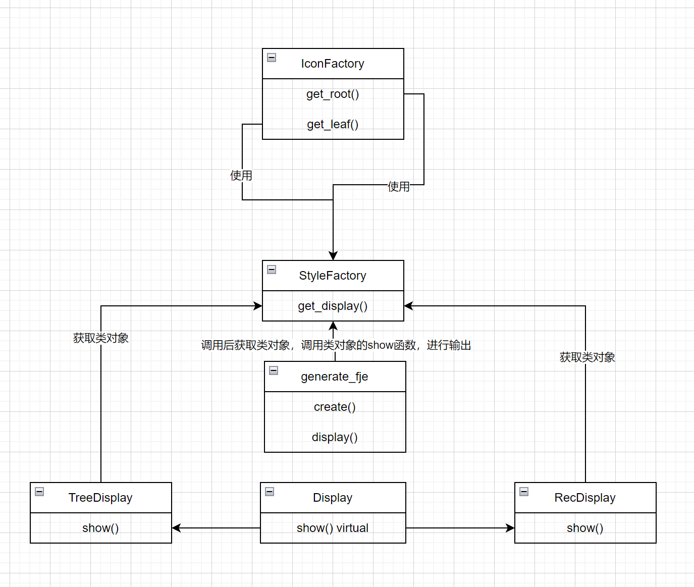
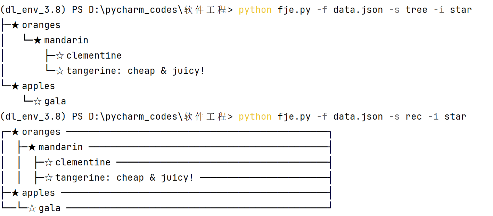
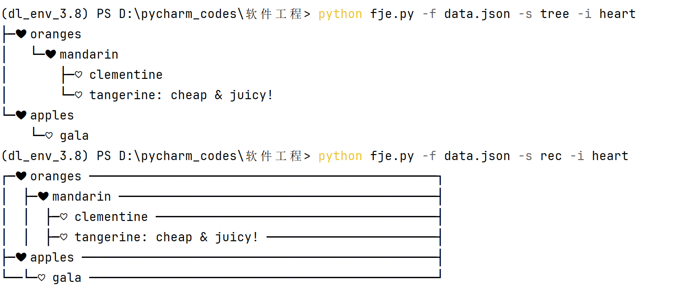

### 设计模式

工厂方法（Factory Method）：包含不同类型的展示对象。

抽象工厂（Abstract Factory）：通过继承抽象工厂创建新的展示对象。

建造者（Builder）：展示JSON数据的可视化表示。

组合模式（Composite Pattern）：使用字典表示JSON数据的树形结构，使得处理JSON数据的层次结构变得简单。

### 类图

### 代码说明

generate_fje类中进行加载json文件，调用display函数获取相应的展示类对象和icon类对象，并且调用该展示类对象的show函数进行输出，调用icon类对象的get_root（其实不应该称作root，但是为了表示方便，与leaf区分所以取名root，实际上是所有非叶节点）和get_leaf函数获取相应icon

show函数对输入的data进行输出

### 运行截图

